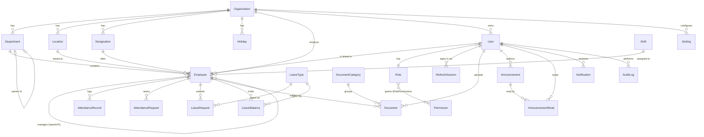

# 2–4 — Database Schema, Prisma Models, ER Diagram

PostgreSQL 16 · Prisma ORM · all timestamps UTC (`timestamptz`) · IDs are `cuid()` strings · money/hours stored as integers (minutes, cents) to avoid float drift.

## Schema principles

1. **Tenant scoping:** every tenant-owned table has `organizationId` + composite indexes starting with it (ADR §1.3).
2. **`User` ≠ `Employee`:** `User` is a login (auth concern); `Employee` is an HR record (domain concern). An employee can exist before being invited to log in; a user (e.g. external auditor) can exist without an employee record. 1↔0..1 relation.
3. **Soft delete only where the domain requires history:** `Employee`, `Document` (`deletedAt`). Everything else hard-deletes; `AuditLog` keeps the trail.
4. **Approvals are uniform:** `LeaveRequest` and `AttendanceRequest` share the same status machine `PENDING → APPROVED | REJECTED | CANCELLED`, same approver fields — so a generic approvals inbox is possible later.
5. **Enums live in Prisma** (DB-level) and are re-exported through `packages/types` so web and api share them.

## ER Diagram



## Prisma models (design artifact — not yet applied)

```prisma
// ─── Identity & Access ────────────────────────────────────────────────

model Organization {
  id        String   @id @default(cuid())
  name      String
  slug      String   @unique
  timezone  String   @default("UTC")
  logoUrl   String?
  createdAt DateTime @default(now())
  updatedAt DateTime @updatedAt

  users        User[]
  employees    Employee[]
  departments  Department[]
  designations Designation[]
  locations    Location[]
  holidays     Holiday[]
  settings     Setting[]
}

model User {
  id             String     @id @default(cuid())
  organizationId String
  email          String     @unique
  passwordHash   String                    // Argon2id
  status         UserStatus @default(INVITED)
  roleId         String
  lastLoginAt    DateTime?
  createdAt      DateTime   @default(now())
  updatedAt      DateTime   @updatedAt

  organization Organization  @relation(fields: [organizationId], references: [id])
  role         Role          @relation(fields: [roleId], references: [id])
  employee     Employee?
  sessions     RefreshSession[]

  @@index([organizationId])
}

enum UserStatus { INVITED ACTIVE SUSPENDED }

model Role {
  id          String  @id @default(cuid())
  code        String  @unique            // ADMIN, HR, MANAGER, EMPLOYEE (seeded)
  name        String
  description String?
  isSystem    Boolean @default(false)    // system roles are not deletable

  users       User[]
  permissions RolePermission[]
}

model Permission {
  id       String @id @default(cuid())
  code     String @unique               // "<resource>.<action>", e.g. "leave.approve"
  resource String
  action   String

  roles RolePermission[]
}

model RolePermission {
  roleId       String
  permissionId String
  role         Role       @relation(fields: [roleId], references: [id], onDelete: Cascade)
  permission   Permission @relation(fields: [permissionId], references: [id], onDelete: Cascade)

  @@id([roleId, permissionId])
}

model RefreshSession {
  id           String    @id @default(cuid())
  userId       String
  tokenHash    String    @unique         // SHA-256 of the opaque refresh token
  userAgent    String?
  ip           String?
  expiresAt    DateTime
  revokedAt    DateTime?
  replacedById String?                   // rotation chain → reuse detection (doc 07)
  createdAt    DateTime  @default(now())

  user User @relation(fields: [userId], references: [id], onDelete: Cascade)

  @@index([userId])
}

// ─── Organization ─────────────────────────────────────────────────────

model Department {
  id             String  @id @default(cuid())
  organizationId String
  name           String
  code           String?
  parentId       String?
  headId         String?  @unique        // Employee who leads this department

  organization Organization @relation(fields: [organizationId], references: [id])
  parent       Department?  @relation("DeptTree", fields: [parentId], references: [id])
  children     Department[] @relation("DeptTree")
  head         Employee?    @relation("DeptHead", fields: [headId], references: [id])
  employees    Employee[]

  @@unique([organizationId, name])
  @@index([organizationId])
}

model Designation {
  id             String @id @default(cuid())
  organizationId String
  title          String
  level          Int    @default(0)      // for org-chart & report grouping

  organization Organization @relation(fields: [organizationId], references: [id])
  employees    Employee[]

  @@unique([organizationId, title])
}

model Location {
  id             String  @id @default(cuid())
  organizationId String
  name           String
  address        String?
  city           String?
  country        String?
  timezone       String?                 // overrides org default (ADR A7)

  organization Organization @relation(fields: [organizationId], references: [id])
  employees    Employee[]
  holidays     Holiday[]

  @@unique([organizationId, name])
}

model Holiday {
  id             String   @id @default(cuid())
  organizationId String
  locationId     String?                 // null = org-wide
  name           String
  date           DateTime @db.Date
  isOptional     Boolean  @default(false)

  organization Organization @relation(fields: [organizationId], references: [id])
  location     Location?    @relation(fields: [locationId], references: [id])

  @@unique([organizationId, locationId, date, name])
  @@index([organizationId, date])
}

// ─── Employees ────────────────────────────────────────────────────────

model Employee {
  id             String         @id @default(cuid())
  organizationId String
  userId         String?        @unique
  employeeCode   String                        // e.g. EMP-0001
  firstName      String
  lastName       String
  workEmail      String
  personalEmail  String?
  phone          String?
  dateOfBirth    DateTime?      @db.Date
  gender         Gender?
  avatarUrl      String?
  addressLine    String?
  city           String?
  country        String?
  departmentId   String?
  designationId  String?
  locationId     String?
  managerId      String?                        // reportsTo
  shiftId        String?
  employmentType EmploymentType @default(FULL_TIME)
  status         EmployeeStatus @default(ACTIVE)
  joinDate       DateTime       @db.Date
  exitDate       DateTime?      @db.Date
  deletedAt      DateTime?                      // soft delete (schema principle 3)
  createdAt      DateTime       @default(now())
  updatedAt      DateTime       @updatedAt

  organization Organization  @relation(fields: [organizationId], references: [id])
  user         User?         @relation(fields: [userId], references: [id])
  department   Department?   @relation(fields: [departmentId], references: [id])
  designation  Designation?  @relation(fields: [designationId], references: [id])
  location     Location?     @relation(fields: [locationId], references: [id])
  manager      Employee?     @relation("ReportsTo", fields: [managerId], references: [id])
  reports      Employee[]    @relation("ReportsTo")
  shift        Shift?        @relation(fields: [shiftId], references: [id])
  headOf       Department?   @relation("DeptHead")

  emergencyContacts EmergencyContact[]
  attendance        AttendanceRecord[]
  attendanceRequests AttendanceRequest[]
  leaveRequests     LeaveRequest[]
  leaveBalances     LeaveBalance[]
  documents         Document[]

  @@unique([organizationId, employeeCode])
  @@index([organizationId, status])
  @@index([organizationId, departmentId])
  @@index([managerId])
}

enum Gender { MALE FEMALE OTHER PREFER_NOT_TO_SAY }
enum EmploymentType { FULL_TIME PART_TIME CONTRACT INTERN }
enum EmployeeStatus { ACTIVE ON_NOTICE EXITED }

model EmergencyContact {
  id         String @id @default(cuid())
  employeeId String
  name       String
  relation   String
  phone      String

  employee Employee @relation(fields: [employeeId], references: [id], onDelete: Cascade)
}

// ─── Attendance ───────────────────────────────────────────────────────

model Shift {
  id             String @id @default(cuid())
  organizationId String
  name           String
  startTime      String                 // "09:00" — local to employee's location TZ
  endTime        String                 // "18:00"
  graceMinutes   Int    @default(15)

  employees Employee[]

  @@unique([organizationId, name])
}

model AttendanceRecord {
  id           String           @id @default(cuid())
  organizationId String
  employeeId   String
  date         DateTime         @db.Date
  checkIn      DateTime?
  checkOut     DateTime?
  workMinutes  Int?                     // computed at checkout / by nightly job
  status       AttendanceStatus @default(PRESENT)
  source       AttendanceSource @default(WEB)
  note         String?
  createdAt    DateTime         @default(now())
  updatedAt    DateTime         @updatedAt

  employee Employee @relation(fields: [employeeId], references: [id])

  @@unique([employeeId, date])
  @@index([organizationId, date])
}

enum AttendanceStatus { PRESENT ABSENT HALF_DAY ON_LEAVE HOLIDAY WEEK_OFF WFH }
enum AttendanceSource { WEB MOBILE ADMIN IMPORT }   // MOBILE/biometric arrive later as new sources

model AttendanceRequest {
  id          String        @id @default(cuid())
  employeeId  String
  date        DateTime      @db.Date
  requestedIn DateTime?
  requestedOut DateTime?
  reason      String
  status      ApprovalStatus @default(PENDING)
  approverId  String?                   // User id
  actedAt     DateTime?
  approverNote String?
  createdAt   DateTime      @default(now())

  employee Employee @relation(fields: [employeeId], references: [id])

  @@index([employeeId, status])
}

enum ApprovalStatus { PENDING APPROVED REJECTED CANCELLED }

// ─── Leave ────────────────────────────────────────────────────────────

model LeaveType {
  id             String  @id @default(cuid())
  organizationId String
  name           String                 // Casual, Sick, Earned…
  code           String
  daysPerYear    Decimal @db.Decimal(5, 1)
  isPaid         Boolean @default(true)
  carryForward   Boolean @default(false)
  maxCarryForward Decimal? @db.Decimal(5, 1)
  requiresApproval Boolean @default(true)

  requests LeaveRequest[]
  balances LeaveBalance[]

  @@unique([organizationId, code])
}

model LeaveBalance {
  id          String  @id @default(cuid())
  employeeId  String
  leaveTypeId String
  year        Int
  allocated   Decimal @db.Decimal(5, 1)
  used        Decimal @db.Decimal(5, 1) @default(0)
  carriedOver Decimal @db.Decimal(5, 1) @default(0)

  employee  Employee  @relation(fields: [employeeId], references: [id])
  leaveType LeaveType @relation(fields: [leaveTypeId], references: [id])

  @@unique([employeeId, leaveTypeId, year])
}

model LeaveRequest {
  id          String         @id @default(cuid())
  employeeId  String
  leaveTypeId String
  startDate   DateTime       @db.Date
  endDate     DateTime       @db.Date
  halfDaySide HalfDaySide?               // null = full days
  days        Decimal        @db.Decimal(5, 1)
  reason      String
  status      ApprovalStatus @default(PENDING)
  approverId  String?
  actedAt     DateTime?
  approverNote String?
  createdAt   DateTime       @default(now())

  employee  Employee  @relation(fields: [employeeId], references: [id])
  leaveType LeaveType @relation(fields: [leaveTypeId], references: [id])

  @@index([employeeId, status])
  @@index([status, startDate])
}

enum HalfDaySide { FIRST_HALF SECOND_HALF }

// ─── Documents ────────────────────────────────────────────────────────

model DocumentCategory {
  id             String @id @default(cuid())
  organizationId String
  name           String                 // Policies, Contracts, Payslips…

  documents Document[]

  @@unique([organizationId, name])
}

model Document {
  id             String    @id @default(cuid())
  organizationId String
  employeeId     String?                 // null = company document
  categoryId     String?
  name           String
  fileKey        String                  // storage key (S3/MinIO) — never a raw URL
  mimeType       String
  sizeBytes      Int
  visibility     DocVisibility @default(PRIVATE)
  uploadedById   String                  // User id
  deletedAt      DateTime?
  createdAt      DateTime  @default(now())

  employee Employee?         @relation(fields: [employeeId], references: [id])
  category DocumentCategory? @relation(fields: [categoryId], references: [id])

  @@index([organizationId, employeeId])
}

enum DocVisibility { PRIVATE ORG }      // PRIVATE = employee + HR/Admin; ORG = everyone

// ─── Announcements & Notifications ────────────────────────────────────

model Announcement {
  id             String   @id @default(cuid())
  organizationId String
  title          String
  body           String                  // markdown
  audience       Audience @default(ALL)
  departmentId   String?                 // when audience = DEPARTMENT
  locationId     String?                 // when audience = LOCATION
  isPinned       Boolean  @default(false)
  publishAt      DateTime @default(now())
  expiresAt      DateTime?
  authorId       String                  // User id
  createdAt      DateTime @default(now())

  reads AnnouncementRead[]

  @@index([organizationId, publishAt])
}

enum Audience { ALL DEPARTMENT LOCATION }

model AnnouncementRead {
  announcementId String
  userId         String
  readAt         DateTime @default(now())

  announcement Announcement @relation(fields: [announcementId], references: [id], onDelete: Cascade)

  @@id([announcementId, userId])
}

model Notification {
  id        String    @id @default(cuid())
  userId    String
  type      String                      // "leave.approved", "attendance.rejected"…
  title     String
  body      String?
  linkPath  String?                     // in-app deep link
  readAt    DateTime?
  createdAt DateTime  @default(now())

  @@index([userId, readAt])
}

// ─── Settings & Audit ─────────────────────────────────────────────────

model Setting {
  organizationId String
  key            String                 // "attendance.autoCheckoutHour", "leave.yearStartMonth"…
  value          Json

  organization Organization @relation(fields: [organizationId], references: [id])

  @@id([organizationId, key])
}

model AuditLog {
  id        String   @id @default(cuid())
  organizationId String
  actorId   String?                     // User id; null = system
  action    String                      // "employee.update", "auth.login"…
  entity    String
  entityId  String?
  meta      Json?                       // diff / context
  ip        String?
  createdAt DateTime @default(now())

  @@index([organizationId, createdAt])
  @@index([entity, entityId])
}
```

## Notable design calls

- **`RefreshSession.replacedById`** implements rotation chains: presenting an already-rotated token revokes the whole chain (doc 07).
- **`AttendanceRecord @@unique([employeeId, date])`** makes "one row per employee per day" a DB invariant, not an application hope.
- **`LeaveBalance` is per-year** — year-end carry-forward is a job that writes next year's rows; history stays queryable for reports.
- **`Document.fileKey`** keeps storage private; downloads go through the API with a permission check and a short-lived signed URL.
- **Reports need no tables** — they are read-model queries over attendance/leave/employees, exported server-side (doc 03).
