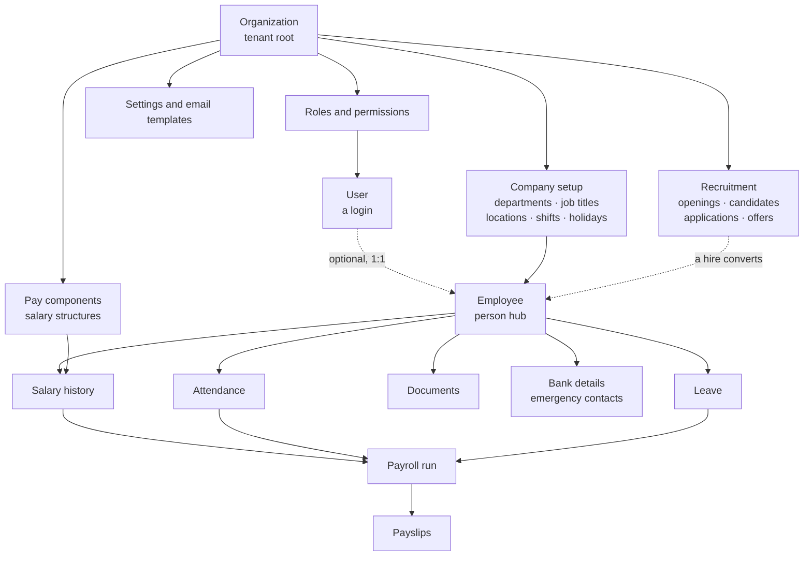
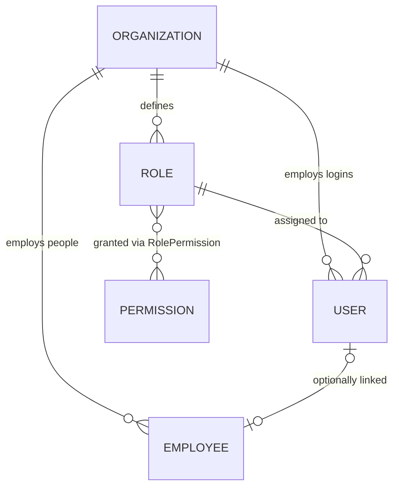
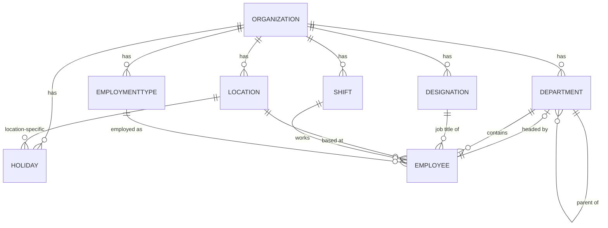
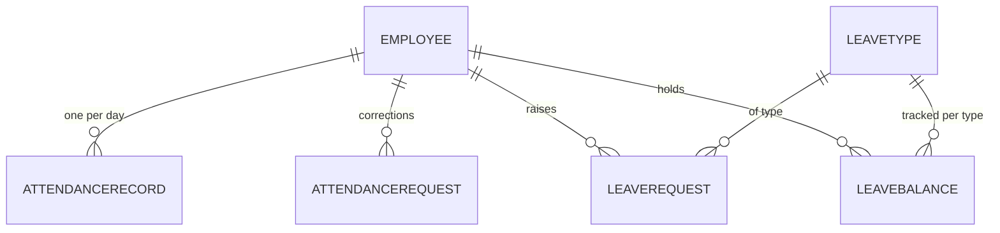
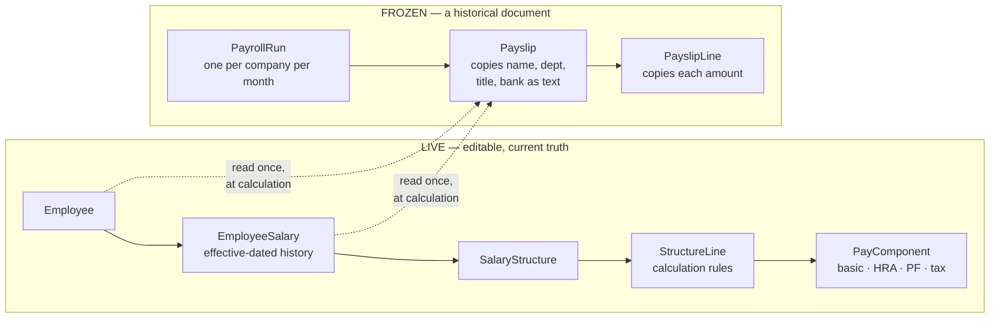
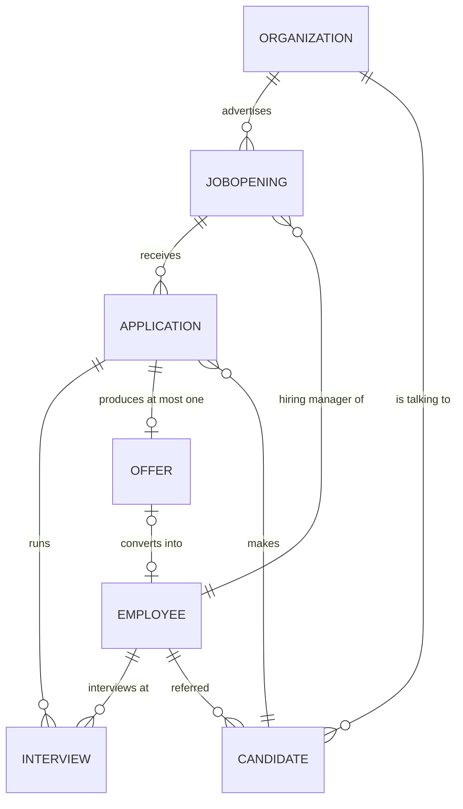
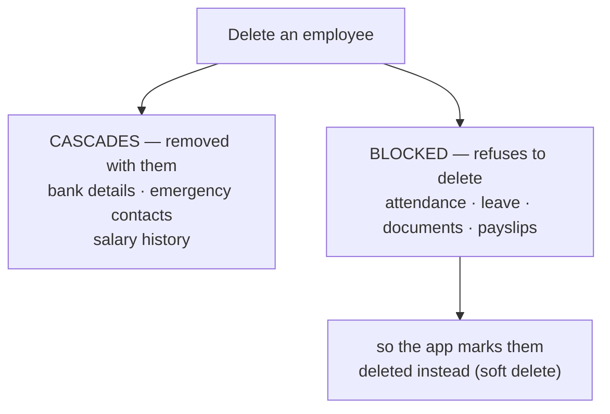

# 13 — How the data connects

How the modules link together, and what happens to one thing when another
changes. For the plain-language tour of what the system *does*, read
[12-how-it-works.md](./12-how-it-works.md). For schema conventions and design
rationale, read [02-database.md](./02-database.md) — this document is about the
*connections between* modules, not the schema rules.

Source of truth: `apps/api/prisma/schema.prisma`.

---

## The shape of it

Two entities hold the system together.

**Organization** is the tenant root. Almost every table carries an
`organizationId`, and no query is ever made without it.

**Employee** is the person hub. Attendance, leave, payroll, documents, bank
details and the whole org hierarchy all hang off it.

Everything else is a spoke on one of those two.

---

## User and Employee: the link everything else depends on

A `User` is a login. An `Employee` is a person record. The link is
`Employee.userId` — **optional and unique**.

| Situation | Meaning |
|---|---|
| Employee with no user | Someone on payroll who never signs in |
| User with no employee | An administrator account that isn't a member of staff |
| Both, linked | The normal case — the system knows the signed-in person *is* that employee |

`User.email` is unique **across the entire installation**, not per company. In a
multi-company deployment one address cannot belong to two companies.

Roles are **per organization**. Each company gets its own copy of the five
system roles, so one company editing "Manager" cannot affect another's.

---

## The company structure

### Two hierarchies that are easy to confuse

They are genuinely independent and answer different questions.

| | Field | Question it answers |
|---|---|---|
| **Reporting line** | `Employee.managerId` | Who approves this person's leave? |
| **Department headship** | `Department.headId` | Who runs this department? |

A department head is not automatically anyone's manager, and a manager need not
head a department. Approvals follow the **reporting line**, never headship.

Both are cycle-checked: an employee cannot end up managing themselves through a
chain, and a department cannot become its own ancestor.

---

## Attendance and leave

Three rules are enforced by the database itself, not by application code — which
means they hold even if something goes wrong in the app:

| Rule | How |
|---|---|
| One attendance record per person per day | unique on `(employeeId, date)` |
| One leave balance per person, per type, per year | unique on `(employeeId, leaveTypeId, year)` |
| One salary change per person per effective date | unique on `(employeeId, effectiveFrom)` |

`LeaveRequest.leaveYear` is **stored on the request** rather than worked out
later. If the company moves its leave year from January to April, requests
already made stay in the year they were booked against — the alternative is
historical requests silently jumping between years and no longer matching the
balances they were deducted from.

---

## Payroll: two chains, deliberately separate

This is the part most worth understanding, because it looks like duplication
until you see why.

**The live chain** is the current answer to "what is this person paid?" Editing a
salary structure changes what everybody on it earns next month.

**The frozen chain** is a record of what was actually paid. A `Payslip` copies
the employee's name, department, job title and bank details **as plain text** at
the moment it is calculated.

This is the one place the system deliberately abandons "store it once". The
reason: a payslip is a document the employee already holds. If it were assembled
from live data, renaming a department would silently rewrite payslips issued
years ago, and they would stop matching the copies people had been given.

**Letters follow the same rule.** An issued `Letter` stores its rendered HTML,
and nothing re-renders it. Editing an offer-letter template changes the next
letter and no earlier one — otherwise a paper copy and the system's copy would
quietly stop matching, which is the failure this whole pattern exists to
prevent.

Consequences worth knowing:

- Editing a salary structure **does not** change payslips already calculated.
- Recalculating a run **deletes and rebuilds** every payslip in it — the only
  way to guarantee that someone since removed actually disappears.
- Correcting a locked or published run is impossible by design; the correction
  goes in the next month's run.

Payroll also *reads* attendance and leave, to work out unpaid days. It does not
write to them.

---

## Recruitment: the one chain that ends where Employee begins

**Read the arrow between `Offer` and `Employee` carefully — it points one way
and it is optional.** `Offer.hiredEmployeeId` is nullable. A candidate is not a
half-built employee waiting to be promoted into one; they are a person the
company is talking to. Most of them will never be staff, and the schema is
arranged so that costs nothing: no employee row is created, and rejecting
somebody deletes nobody.

The link is written by exactly one action — `POST /recruitment/offers/:id/hire`
— and that action does not create the employee itself. It calls the same
`OnboardingService.onboard` that HR's *Onboard a hire* screen calls, so the new
starter arrives in the system through the one door every other new starter uses.

`Application.organizationId` is denormalised off the opening, so a pipeline can
be counted and scoped without a join. That is the same trade every module here
makes.

Three of the four employee arrows are advisory rather than structural: the
hiring manager, the interviewer and the referrer are all nullable, because an
opening can exist before anybody owns it and a candidate can arrive from
nowhere in particular.

---

## What happens when you delete something

Three different behaviours, and the difference matters.

**Cascade** — deleted alongside the parent: bank details, emergency contacts,
salary history, payslip lines, announcement attachments and read receipts,
sessions and password-reset tokens.

**Blocked** — the database refuses while dependants exist. An employee with any
attendance, leave, documents, payslips or letters **cannot be hard-deleted**.
Departments, job titles and locations are likewise protected while anyone
references them.

A `Letter` has no delete path at all, not even a soft one. It is withdrawn
(`status = VOID`, with a reason) and still renders: a copy is already in
someone's hands, so "we withdrew it, and here is why" is an answer where "it
never existed" is not.

**Soft delete** — the real removal path for people and documents. A `deletedAt`
timestamp is set; the record vanishes from every list but the history survives.
This is why offboarding never destroys last year's payroll.

Deleting a *user* removes their sessions but leaves the *employee* record intact.

Recruitment follows both rules and it is worth being explicit about which is
which. Deleting a **candidate** or an **opening** cascades to their
applications, and an application cascades to its interviews and its offer —
because none of those mean anything without the thing they hang off. But an
**employee** referenced as a hiring manager, an interviewer, a referrer, or the
person a hire became is *blocked*, not nulled: the record says who ran that
interview loop, and losing that would leave feedback signed by nobody. In
practice this never bites, because people are soft-deleted.

---

## Two things that are not what they look like

### Tenant scoping is repeated on purpose

Most operational tables carry their own `organizationId` even though it could be
derived through the employee. `AttendanceRecord`, `Document`, `Payslip`,
`Announcement` and others all store it directly.

That is redundant, and intentional. It means a query can prove which company a
row belongs to without joining through three tables — so a filter can never be
forgotten in a join and leak another company's data.

### Some links are not enforced by the database

Roughly a dozen `*Id` columns are plain text with **no foreign key**:

| Column | Enforced? | Why |
|---|---|---|
| `AuditLog.actorId`, `AuditLog.organizationId` | No — **intentional** | An audit entry must outlive the user who caused it. A foreign key would either block deleting that user or delete the evidence. |
| `LeaveRequest.approverId`, `AttendanceRequest.approverId` | No | Incidental |
| `PayrollRun.calculatedById` / `approvedById` / `lockedById` / `publishedById` | No | Incidental |
| `Announcement.authorId` / `departmentId` / `locationId` | No | Incidental |
| `AnnouncementRead.userId`, `Notification.userId`, `Document.uploadedById` | No | Incidental |

For the audit log this is a considered design decision. For the rest it is not
deliberate, and it means the database will not stop these columns pointing at
something that no longer exists. Treat them as hints, not guarantees, and expect
to handle a missing record when reading them.

---

## Quick reference: what links to what

| To find… | Follow |
|---|---|
| An employee's company | `Employee → Organization` (direct) |
| Who approves someone's leave | `Employee.managerId` |
| What someone earns today | latest `EmployeeSalary` with `effectiveFrom` ≤ today |
| What someone was paid in March | `PayrollRun (March) → Payslip → PayslipLine` |
| Whether a day was a holiday | `Holiday` for the org, plus the employee's `Location` |
| When a shift starts for someone | `Employee → Shift` |
| Someone's leave allowance | `LeaveBalance (employee, type, year)` |
| Who changed a salary | `AuditLog` filtered by entity and id |
| Everyone live in a pipeline | `JobOpening → Application` where stage is not HIRED/REJECTED/WITHDRAWN |
| Which employee an offer became | `Offer.hiredEmployeeId` — null until it is converted |
| Every role somebody has applied for | `Candidate → Application → JobOpening` |
| What an interviewer said | `Interview.notes`, once `submittedAt` is set — before that, nothing was said |
